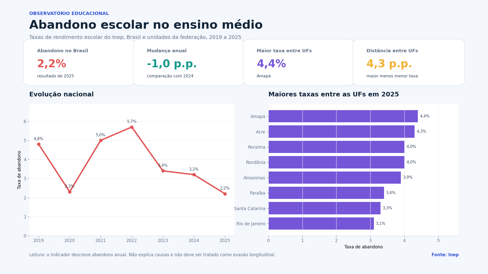

<div align="center">

# Observatório do abandono escolar no ensino médio

Análise territorial das taxas de rendimento escolar publicadas pelo Inep para o período de 2019 a 2025.

[](https://www.python.org/)
[](https://pandas.pydata.org/)
[](https://streamlit.io/)
[](https://plotly.com/python/)
[](#testes)
[](LICENSE)

</div>



## Problema analisado

Uma taxa nacional isolada não mostra como o abandono escolar se distribui pelo território. Este projeto transforma os arquivos públicos do Inep em uma ferramenta para responder perguntas objetivas:

1. Como aprovação, reprovação e abandono mudaram entre 2019 e 2025?
2. Quais unidades da federação ficaram acima do resultado brasileiro?
3. Qual é a diferença entre áreas urbanas e rurais?
4. Como as dependências administrativas se comparam?
5. Quais mudanças merecem novas perguntas e investigação local?

O painel é descritivo. Ele organiza evidências agregadas e não atribui causas ao abandono.

## Abandono não é sinônimo perfeito de evasão

O nome histórico do repositório usa evasão escolar, mas a fonte analisada publica a **taxa anual de abandono** como parte das Taxas de Rendimento Escolar. Evasão é um conceito mais amplo e pode exigir acompanhamento da trajetória do estudante ao longo do tempo.

Para preservar a precisão, o código, o painel e as conclusões usam o termo abandono.

## Principais resultados

No recorte nacional total:

| Indicador | Resultado |
|---|---:|
| Abandono em 2019 | 4,8% |
| Maior taxa do período, em 2022 | 5,7% |
| Abandono em 2025 | 2,2% |
| Mudança entre 2024 e 2025 | -1,0 p.p. |
| Aprovação em 2025 | 94,8% |

Entre as unidades da federação em 2025:

| Leitura | Resultado |
|---|---:|
| Maior taxa | Amapá, 4,4% |
| Menor taxa | Mato Grosso, 0,1% |
| Distância entre maior e menor taxa | 4,3 p.p. |
| Maior diferença rural menos urbana | Acre, 6,4 p.p. |

Os anos de 2020 e 2021 precisam ser interpretados com cautela por causa do funcionamento excepcional das redes de ensino durante a pandemia. As comparações descrevem o que foi publicado e não medem o efeito de políticas públicas.

## O aplicativo

O Streamlit foi organizado em seis áreas:

| Área | O que responde |
|---|---|
| Resumo executivo | Situação nacional, mudança anual e distância entre UFs |
| Evolução | Trajetória de até seis territórios e comparação entre anos |
| Territórios | Ranking das 27 UFs, distribuição regional e série de uma UF |
| Desigualdades | Diferenças por localização e dependência administrativa |
| Matriz de monitoramento | Taxa atual combinada com a mudança desde o ano-base |
| Dados e método | Cobertura, limitações, tabela e download do recorte |

A matriz de monitoramento não é um modelo preditivo. Ela usa duas regras fáceis de explicar: posição em relação ao Brasil e direção da mudança desde o ano-base.

## Dados

Fonte: [Inep, Taxas de Rendimento Escolar](https://www.gov.br/inep/pt-br/acesso-a-informacao/dados-abertos/indicadores-educacionais/taxas-de-rendimento-escolar).

- Período: 2019 a 2025.
- Abrangência: Brasil, cinco regiões e 27 unidades da federação.
- Recortes: localização e dependência administrativa.
- Arquivo processado: 4.105 linhas.
- Linhas completas para as três taxas: 3.783, equivalentes a 92,2%.
- Valores ausentes: mantidos como ausentes, sem imputação.

O CSV processado fica no repositório para que o aplicativo funcione sem depender de uma nova conexão. O script `scripts/preparar_dados.py` documenta e reproduz a extração.

Leia também [fontes e metodologia](docs/fontes-e-metodologia.md) e o [dicionário de dados](docs/dicionario-de-dados.md).

## Estrutura do projeto

```text
.
├── app.py
├── assets/
│   ├── capa_linkedin.png
│   └── dashboard_abandono_escolar.png
├── data/
│   └── taxas_rendimento_ensino_medio_2019_2025.csv
├── docs/
├── notebooks/
│   └── analise_exploratoria.ipynb
├── scripts/
│   ├── gerar_visualizacoes.py
│   └── preparar_dados.py
├── src/
│   ├── analysis.py
│   ├── data.py
│   └── formatting.py
└── tests/
```

## Como executar

No macOS ou Linux:

```bash
python3.14 -m venv .venv
source .venv/bin/activate
python -m pip install --upgrade pip
python -m pip install -r requirements.txt
python -m streamlit run app.py
```

No Windows, substitua o comando de ativação por:

```powershell
.venv\Scripts\activate
```

## Reproduzir os dados e as imagens

Para baixar novamente os arquivos anuais do Inep e reconstruir o CSV:

```bash
python scripts/preparar_dados.py
```

Para gerar as duas imagens usadas no portfólio:

```bash
python scripts/gerar_visualizacoes.py
```

## Testes

```bash
python -m pip install -r requirements-dev.txt
python -m pytest -q
```

Os testes verificam esquema, período, duplicidades, consistência das taxas, ranking das UFs, indicadores nacionais, comparação temporal, diferença rural e urbana e formatação em português.

## Decisões analíticas

- Não foi criado um modelo de previsão porque a base é agregada e não possui características individuais de estudantes.
- Não houve preenchimento de valores ausentes.
- O ranking compara recortes equivalentes do mesmo ano.
- A distância entre territórios é apresentada em pontos percentuais.
- A matriz de monitoramento é uma regra descritiva, não uma classificação de risco.
- Nenhuma associação é apresentada como causa.

As justificativas completas estão em [decisões do projeto](docs/decisoes-do-projeto.md).

## Limitações

- Indicadores agregados não explicam decisões ou trajetórias individuais.
- Mudanças de registro, gestão e contexto podem afetar comparações anuais.
- Os anos de pandemia exigem leitura contextual.
- Uma taxa menor não demonstra, isoladamente, que determinada política causou o resultado.
- Diagnósticos locais precisam combinar estes indicadores com matrícula, frequência e contexto socioeconômico.

## Autor

**Bruno Nunes**
Ciência de Dados e Inteligência Artificial

[LinkedIn](https://www.linkedin.com/in/bruno-dsnunes/) | [GitHub](https://github.com/bruno-dsn)
